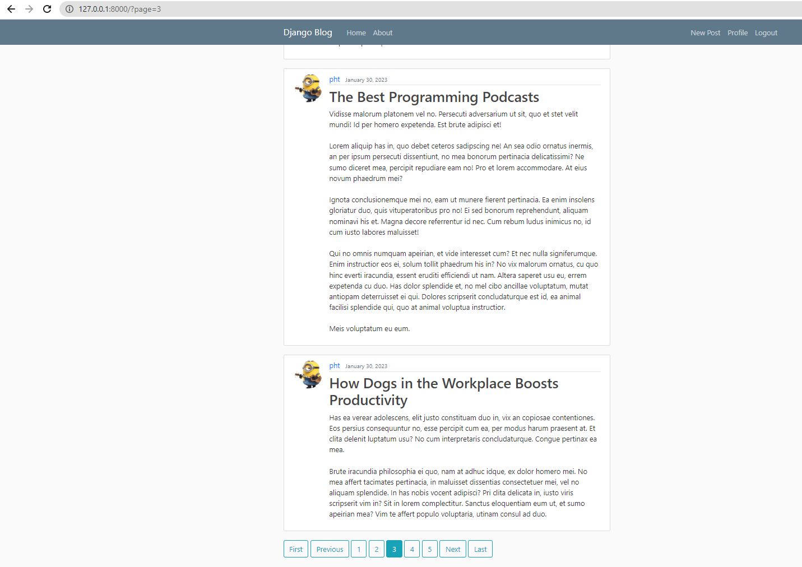

# django-blog-website
Learning Django Framwork to create a blog website (Bootstrap as a frontend)
> Source: Django Tutorials of Corey Schafer
## Feature:
1. Authentication
2. Admin Site
3. CRUD Post
4. Update User Profile
5. Pagination
6. Email and Password Reset
7. Deployment (Options)
8. Enable HTTPS with a free SSL/TLS Certificate
9. Using AWS S3 for File Uploads
10. 

## import post into db
```bash
python manage.py shell
```

```python
import json
from blog.models import Post
with open('posts.json') as f:
    posts_json = json.load(f)
for post in posts_json:
    post = Post(title=post['title'], content=post['content'], author_id=post['user_id'])
    post.save()
exit()
```

## Set Gmail and password environment to reset password

```bash
set EMAIL_HOST_USER=phanhoaithuabc@gmail.com
set EMAIL_HOST_PASSWORD=***
```

## Create a migration for the project

```bash
python manage.py makemigrations
```

## Migrate database of the project

```bash
python manage.py migrate
```

## Create superuser for admin page

```bash
python manage.py createsuperuser
```
## Collect static files

```bash
python manage.py collectstatic
```
## Run the project

```bash
python manage.py runserver
```

## Deploy to a Linux(Ubuntu) Server 
1. Create a Ubuntu server and connect to the server
```bash
# Edit hostname
apt-get update -y && apt-get upgrade -y
hostnamectl set-hostname django-blog-server
nano /etc/hosts
# put server ip address in /etc/hosts like this:
# 198.58.119.178    django-blog-server

# Create a new user
adduser pht
adduser pht sudo
```
2. Log in with new user
```bash
ssh pht@198.58.119.178
```
3. Set up SSH Key Based Authentication
> To log in a server without password
```bash
mkdir -p ~/.ssh
# On local machine:
ssh-keygen -b 4096
# Put the public key in server and use private key in local to ssh
scp ~/.ssh/id_sra.pub pht@198.58.119.178:~/.ssh/authorized_keys
```
4. Update SSH Permissions
```bash
sudo chmod 700 ~/.ssh/
sudo chmod 600 ~/.ssh/*
exit
```
5. Change SSH Permissions
```bash
sudo nano /etc/ssh/sshd_config
# Set PermitRootLogin no
# Set PasswordAuthentication no
sudo systemctl restart sshd
```
6. Install and Enable UFW (uncomplicated firewall)
```bash
sudo apt-get install ufw
# Set up a few basic rule
sudo ufw default allow outgoing
# Deny all incoming traffic can lock you out of the server unless you
# explicitly allow SSH access
sudo ufw default deny incoming
sudo ufw allow ssh
sudo ufw allow 8000
sudo ufw enable
sudo ufw status
```
7. Set up new environment
```bash
scp -r django-blog-website pht@@198.58.119.178:~/
sudo apt-get install python3-pip
sudo apt-get install python3-venv
python3 -m venv django-blog-website/venv
cd django-blog-website
source venv/bin/activate
pip install -r requirements.txt
sudo nano django-blog-website/settings.py
# Edit ALLOWED_HOSTS = ['anydomain.com', '198.58.119.178']
```
8. Install Apache
```bash
sudo apt-get install apache2
sudo apt-get install libapache2-mod-wsgi-py3
cd /etc/apache2/sites-available/
sudo cp 000-default.conf django-blog-website.conf
sudo nano django-blog-website.conf
# Add a line before </VirtualHost>: 
# Alias /static /home/pht/django-blog-website/static
# <Directory /home/pht/django-blog-website/static>
#   Require all granted
# </Directory>
# Alias /media /home/pht/django-blog-website/media
# <Directory /home/pht/django-blog-website/media>
#   Require all granted
# </Directory>
# <Directory /home/pht/django-blog-website/django-blog-website>
#   <Files wsgi.py>
#       Require all granted
#   </Files>
# </Directory>
# WSGIScriptAlias / /home/pht/django-blog-website/django-blog-website/wsgi.py
# WSGIDeamonProcess django-blog python-path=/home/pht/django-blog-website python-home=/home/pht/django-blog-website/venv
# WSGIProcessGroup django-blog
```
9. Enable Site through Apache and update permissions
```bash
sudo a2ensite django-blog-website 
sudo a2dissite 000-default.conf
sudo chown :www-data django-blog-website/db.sqlite3
sudo chmod 664 django-blog-website/db.sqlite3
sudo chown :www-data django-blog-website/
sudo chown -R :www-data django-blog-website/media/
sudo chmod -R 775 django-blog-website/media
sudo chmod 775 django-blog-website/

sudo touch /etc/config.json
# Copy SECRET_KEY variable in settings.py file to /etc/config.json:
# {
#     "SECRET_KEY": "********************************",
#     "EMAIL_USER": "phanhoaithuabc@gmail.com"
#     "EMAIL_PASS": "***"
# }

sudo nano django-blog-website/django_project/settings.py
# import json
# with open("/etc/config.json") as config_file:
#     config = json.load(config_file)
# SECRET_KEY = config["SECRET_KEY"]
# debug = False
# EMAIL_HOST_USER = config["EMAIL_USER"]
# EMAIL_HOST_PASSWORD = config["EMAIL_PASS"]
sudo ufw delete allow 8000
sudo ufw allow http/tcp
sudo service apache2 restart
```

10. Enable HTTPS with a free SSL/TLS Certificate
```bash
sudo apt-get update
sudo apt-get install software-properties-common
sudo add-apt-repository universe
sudo add-apt-repository ppa:certbot/certbot
sudo apt-get update
sudo apt-get install python-certbot-apache

# (Optional)
sudo nano /etc/apache2/site-available/django-blog-website.conf
# Edit ServerName www.anydomain.com

sudo ufw allow https

sudo certbot --apache

sudo certbot renew --dry-run

# Get cer update every 90 days
sudo crontab -e
# Choose: 1. /bin/nano
# Add line: 30 4 1 * * sudo certbot renew --quiet 
```

11. Using AWS S3 for File Uploads
- Create a bucket on s3 and edit CORS configuration:
    ```xml
    <?xml version="1.0" encoding="UTF-8"?>
    <CORSConfiguration xmlns="http://s3.amazonaws.com/doc/2006-03-01/">
    <CORSRule>
            <AllowedOrigin>*</AllowedOrigin>
            <AllowedMethod>GET</AllowedMethod>
            <AllowedMethod>POST</AllowedMethod>
            <AllowedMethod>PUT</AllowedMethod>
            <AllowedHeader>*</AllowedHeader>
        </CORSRule>
    </CORSConfiguration>
    ```
- Create a IAM user and attach AmazonS3FullAccess to it
- Open ~/.bash_profile and configure:
    ```bash
    export AWS_ACCESS_KEY_ID="***"
    export AWS_SECRET_ACCESS_KEY="***"
    export AWS_STORAGE_BUCKET_NAME="django-blog-files"
    ```

> [Deploy check list ref](https://docs.djangoproject.com/en/4.1/howto/deployment/checklist/)

## Some Application Image



